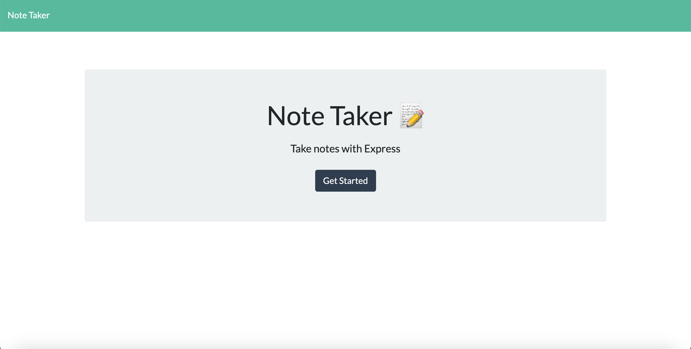

# Express.js: Note Taker

## Description

This applicaion allows users to create notes on Note Taker that can be used to write and save notes. This application uses an Express.js back end and will save and retrieve note data from a JSON file.

## Usage 
- [Github Repo](https://github.com/vchan852/note-taker)

## Images

Picture displays the preview of the note taker application.